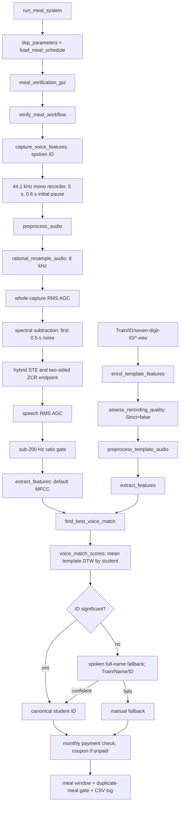

# Preserved v4.1.4 execution and recording audit

This audit describes the **unchanged source supplied at the start of this task**. Later development in the working project is deliberately excluded from the baseline. The source of record is `C:\Users\sindi\Downloads\312  proj update last\preservation\archive_original\312  proj update\Final project v4.1.4`. `baseline_audit.m` requires that source path explicitly, checks MATLAB function resolution, and compares source/config/audio SHA-256 hashes before and after execution. `Results/audit_baseline/source_manifest.csv`, `parameters.json`, `baseline_snapshot.mat`, and `run_summary.json` identify the executed code, effective settings, extracted features, and runtime.

Labels in this report are **directory labels**, supported where available by profile metadata. No independent listening adjudication or identity witness establishes that each waveform contains the claimed words or belongs to the named physical speaker. The exact live recording behind the reported “150 detected as 149” incident was not identified in the supplied files; an offline challenge is not a reproduction of that exact incident.

## Checklist

- [x] Inspect preserved entry points, DSP, enrollment, matching, workflow, configuration, legacy scripts, and stored result schemas.
- [x] Establish four-person deployed roster and locate archived 2206150 candidate recordings.
- [x] Implement an isolated baseline diagnostic with self-match exclusion and original-function scoring.
- [x] Complete MATLAB baseline run, verify output contract and immutable source hashes.
- [x] Inspect generated top-five rankings and quality measurements; add measured case findings.
- [x] Visually inspect the four generated case-study plots (25 September 2026).

## What actually executes



`run_meal_system('check')` calls `verify_dsp_pipeline`; this is a diagnostic entry point, not proof of hardware/microphone operation. `run_meal_system('dft')` uses `select_feature_frontend` to select the alternate frontend and its threshold. `voice_recognition_gui.m` is a compatibility launcher. `voice_recognition_gui1.m` and the `untitled*.m` scripts are older interfaces and must not be used to infer the current kiosk behavior.

The active workflow identifies from spoken ID first. It retries live ID capture up to three total attempts. The name stage occurs only after an unconfident ID. A successful ID does **not** require a second independently agreeing name. Coupons are typed monthly payment tokens; legacy `Train/Coupon` audio is not part of current identity recognition. Several headers still describe the superseded name-plus-spoken-coupon agreement workflow.

## Implementation status at audit start

“IMPLEMENTED” means an executable source path exists, not that the supplied corpus establishes production accuracy.

| Component | Status | Executable evidence and limitations |
|---|---|---|
| 44.1 kHz acquisition, countdown, stop | IMPLEMENTED | `capture_voice_features`, `record_audio_dsp`, GUI recording callbacks; microphone operation needs a live device session. |
| 44.1 to 8 kHz rational conversion | IMPLEMENTED | `rational_resample_audio`; FIR/resample path with L/M = 80/441 for native capture. |
| Capture and speech RMS AGC | IMPLEMENTED | `agc_normalize`, twice in `preprocess_audio`. Target .05, gain cap 40, headroom .99. |
| Ambient spectral subtraction | IMPLEMENTED | `spectral_subtract_noise`; first .50 s, 32 ms frames, .25 hop fraction, oversubtraction 2, floor .02. |
| Energy + ZCR endpointing | IMPLEMENTED | `hybrid_endpoint_detect`; 20 ms frames, 10 ms hop, adaptive STE, two-sided ZCR, gap bridge, short-run removal, outer speech interval. |
| Sub-200 Hz live/replay heuristic | PARTIAL | `check_liveness_lowfreq`; ratio in [0.00024,.7] over [20,200]/[20,3800] Hz. No labeled real replay corpus or hardware validation supplied. |
| Stored/live preprocessing equivalence | PARTIAL | `preprocess_template_audio` branches on lead/full RMS ratio .35; raw quiet-lead route delegates to live chain; legacy-cropped route disables subtraction and treats liveness advisory. This is intentionally not one identical path for all WAVs. |
| Recording quality gate | IMPLEMENTED | `assess_recording_quality`; clipping, levels, speech duration, lead-in diagnostics. Stored enrollment uses Strict=false; current recording/import quality paths are stricter. |
| MFCC frontend | IMPLEMENTED | `extract_mfcc_dsp`: 25 ms/10 ms, Hamming, 26 mel filters over 300–3700 Hz, 13 liftered coefficients including c0, delta + delta-delta = 39 dimensions. No default pre-emphasis, CMS or CMVN. |
| Uniform DFT log-band frontend | EXPERIMENTAL | `extract_dft_features`, selectable with `select_feature_frontend`; 24 bands, 30 ms/15 ms, 80–3800 Hz, CMVN, delta disabled. Not deployed default. |
| MFCC/DFT parameter sweeps | EXPERIMENTAL | `experiment_frontend_comparison`, `experiment_channel_robustness`, calibration scripts; conditions need protocol-specific interpretation. |
| Banded Euclidean DTW | IMPLEMENTED | `dtw_distance_dsp`; Sakoe-Chiba .30 with length-difference expansion, accumulated cost divided by N+M. |
| Per-student template score | IMPLEMENTED | `voice_match_scores`: mean finite template distances; minimum score wins. Not minimum-template voting. |
| Nearest-student ranking and margin | IMPLEMENTED | Winner and runner-up, ratio runner/winner; one remaining candidate gives infinite margin. |
| Spoken-digit recognition/transcription | MISSING | No ASR, digit segmentation, digit lexicon, sequence decoder, or explicit decoded “149”/“150.” Output ID is the winning folder label. |
| Seven-digit identity folders/profile metadata | IMPLEMENTED | `student_id_contract`, `student_profile_paths`, `student_profile`, `list_id_profiles`; name metadata is not the identity key. |
| ID-first, then name fallback | IMPLEMENTED | `verify_meal_workflow`; threshold, runner comparison, ID ambiguity candidate set. |
| Independent name + coupon agreement | OBSOLETE | Described by old headers/experiments; not mandatory in active ID-first path. |
| Strong open-set unknown-speaker model | MISSING | Current absolute threshold/margin are heuristic rejection gates; no trained unknown model and no guarantee of rejecting out-of-roster voices. |
| “Voice similarity %” probability | MISSING | Display uses clamped `round(100 - distance/threshold*35)`, range 5–99. This is a display transformation, not calibrated confidence or recognition probability. |
| Enrollment cache | PARTIAL | `find_best_voice_match` caches feature matrices by path/mtime and selected settings. Original key omits several relevant DSP options despite its “every parameter” comment. |
| Corpus diagnostics | IMPLEMENTED | `diagnose_audio_corpus`, `assess_recording_quality`, `record_corpus_tool`; results are recording suitability, not verified identity accuracy. |
| Held-out current-workflow accuracy | PARTIAL | Older `experiment_verification_accuracy` models the older Name/Coupon task, not the present ID-first/name-fallback workflow. Supplied historical pairwise CSVs are not fresh current-workflow evidence. |
| Exact external senior project | MISSING | No `PROJECT_MFCC.m`, `framing.m`, or original external senior package found in preserved archive. See provenance below. |
| Reimplemented waveform correlation | EXPERIMENTAL | `xcorr_distance_dsp` implements a controlled correlation comparator; it does not establish exact senior-source reproduction. |
| Monthly coupon registry | IMPLEMENTED | `monthly_coupon_registry`, assign/consume wrappers; month-bound identity token, one use. |
| Monthly fee entitlement | IMPLEMENTED | `monthly_fee_entitlement`; payment is recorded after coupon consumption. CSV writes are not a database transaction. |
| Meal scheduling and duplicate prevention | IMPLEMENTED | `load/save/validate_meal_schedule`, `meal_window_now`, `log_meal_csv`; configurable service windows and per-day/per-window duplicate check. |
| Manual fallback | IMPLEMENTED | `manual_entry_workflow`; valid enrolled folder ID plus entitlement rules. It does not provide voice evidence. |
| Admin controls, enrollment rollback/discard | IMPLEMENTED | `admin_*`, `rollback_enrol_session`, `enrol_discard_profile`, `delete_student_recordings`, GUI callbacks. |
| Thread/process-safe multi-counter storage | MISSING | Flat CSV read/modify/write operations, no locking/transaction layer in supplied code. |

## Important executable details

1. **The baseline does not “hear the number 149.”** It compares an utterance against recordings filed under enrolled IDs. Shared spoken digit prefixes, speaker/channel traits, endpoint loss and feature scaling can affect that comparison; a folder label is not a transcript.
2. **ID significance has a threshold escape.** A best score below 37.1585 is sufficient when the runner-up is outside that threshold, even when the ratio is below 1.20. The ratio is enforced when both nearest candidates are inside the threshold. This is weaker than an unconditional winner/runner margin.
3. **Name fallback can bypass its own margin for an ID candidate.** When the ID stage records two ambiguous candidates, a name winner belonging to that pair is accepted if its distance passes; the name margin need not pass. The active behavior is not independent two-phrase agreement.
4. **Candidate messaging precedes final entitlement.** The source displays a detected identity/similarity before significance is established and contains “access granted” wording before coupon/meal logging checks. A displayed nearest identity and a completed meal transaction must be distinguished.
5. **Preprocessing can retain only a fraction of a digit phrase.** Endpointing uses local energy/ZCR support and returns the first-to-last surviving interval; it does not know how many digits were spoken. Exact boundaries and feature frames are therefore essential in the 149/150 case. The audit plots raw waveform, denoised spectrogram, energy threshold, ZCR bounds and retained mask.
6. **Noise subtraction assumes a quiet leading .5 s.** A contaminated pre-roll can suppress speech. Stored archives lacking a quiet lead use a different compatibility route. The `RawWithQuietLeadIn` branch calls the live pipeline, which may reject liveness despite the broader archived-liveness-advisory comment.
7. **DTW documentation contains stale claims.** The actual normalizer is N+M, not the optimal path length. Frames are spaced by time, so reducing sampling rate does not divide the number of 10 ms frames by 5.5 or reduce DTW cells by 30. It reduces sample/FFT work. Measured timing is needed for total-speed claims.
8. **Cache invalidation is incomplete in the original.** The key includes frontend, rate, several DFT/MFCC settings and template thresholds, but omits e.g. mel band/lifter, AGC, subtraction, endpoint and liveness options. Baseline audit uses direct extraction and immutable parameters to avoid cross-experiment cache contamination.

## Corpus and label provenance

| Location | Content | Role in this audit |
|---|---|---|
| Preserved v4.1.4 `Train/ID` | 2206141, 2206147, 2206148, 2206149; three WAVs each | Exact baseline enrollment and leave-one-recording-out queries. |
| Preserved v4.1.4 `Train/Name` | Same four IDs; three WAVs each | Exact baseline enrollment and leave-one-recording-out queries. |
| Preserved v4.1.4 `Train/Coupon/2206147` | Six WAVs | Legacy phrase diagnostic only; not current identity flow. |
| Preserved v4.1.3 `Train/ID/2206150`, `Train/Name/2206150` | Three WAVs per phrase | Candidate-only, never added to v4.1.4 enrollment. |
| Preserved `worktrees/stoic-bartik-7f65fd/Final project v4.1.3` corresponding 150 paths | Six physical WAV paths | Byte hashes identify whether these are duplicates; duplicate paths remain in inventory but are not additional statistical samples. |

The preserved v4.1.4 roster has **no 2206150 profile or audio templates**. An ID matcher with this roster cannot select 2206150. This is a confirmed roster limitation; it is not by itself proof that a particular audio record will choose 2206149 or be granted a meal.

The audit emits one row per physical path in `inventory_all_paths.csv` and deduplicates query files by SHA-256. Every queried enrolled WAV is excluded from its own library, including byte-identical copies. This avoids the GUI demo's in-library same-recording shortcut. Five ranked rows are present per recording and mode: unavailable ranks are explicitly empty/Inf, because four enrolled students cannot produce five genuine candidate identities. Coupon has only one identity.

There is no claim that filenames `1.wav`, `2.wav`, `3.wav` establish independent dates, devices, rooms, or recording sessions. The archive has no reliable session manifest. These takes are distinct files, not proven independent speakers/sessions. Do not call a within-archive result an external test-set estimate.

## Senior baseline provenance

`untitled.m` is a menu-driven legacy name/coupon enrollment and test script: 44.1 kHz, 3 s, energy-only cropping, pre-emphasis .97, MFCC+delta+delta-delta and unconstrained DTW normalized by N+M, averaged by person, with threshold 30 and a typed saved code. `untitled2.m` is another interactive variant using 2 s and threshold .5. Their feature/endpoint/DTW functions are local functions embedded in scripts. Neither is an original waveform-cross-correlation-only pipeline.

The current parameter comments refer to external senior `framing.m`/`PROJECT_MFCC`; those actual files were not located. Consequently:

- “Senior baseline MFCC, 16 kHz” in `experiment_frontend_comparison` is a controlled condition using the current extractors and preprocessing with overrides, **not an exact original senior execution**.
- `xcorr_distance_dsp` is a transparent reimplementation of a correlation comparator, **not evidence of source identity** with an unavailable senior project.
- An exact senior-versus-improved claim requires the actual senior package and a documented compatible evaluation protocol. This audit does not invent that missing provenance or score a fabricated senior row.

## Existing results and configuration are historical evidence

At audit start `Results` contains `frontend_comparison.csv` and `corpus_diagnostics.csv`; no plotted PNG/FIG artifacts are present there. The frontend CSV has 24 genuine pairs and a deployed-MFCC EER entry of 8.3333%, while comments describe 97 genuine pairs and 576 impostor pairs, 121 live templates and older 25-student experiments. Those are different corpora/protocols. The historical CSV and prose do not establish an error rate for the present ID-first workflow or the 150 challenge. Fresh measurements belong only under the new audit/experiment output folders.

The exact preserved service CSV configures Breakfast 07:00–09:30, Lunch **12:00–16:30**, Dinner 19:00–21:30. Default/example prose stating 14:30 lunch closing is not the stored active setting. Existing meal rows are historical records, not evidence of a freshly reproduced recognition. Monthly payment/coupon data are preserved, not consumed by this audit.

## Reproduction and outputs

Run from the working project, using the explicit preserved path:

```matlab
s = 'C:\Users\sindi\Downloads\312  proj update last\preservation\archive_original\312  proj update';
candidates = {fullfile(s,'Final project v4.1.3','Train','ID','2206150'), ...
              fullfile(s,'Final project v4.1.3','Train','Name','2206150'), ...
              fullfile(s,'worktrees','stoic-bartik-7f65fd','Final project v4.1.3','Train','ID','2206150'), ...
              fullfile(s,'worktrees','stoic-bartik-7f65fd','Final project v4.1.3','Train','Name','2206150')};
baseline_audit(fullfile(s,'Final project v4.1.4'), candidates, ...
               fullfile(pwd,'Results','audit_baseline'));
```

`archived` queries use the original stored-template gate. `live_replay` applies the exact original live preprocessing offline to the raw WAV. It tests a processing route; it is not acoustic loudspeaker replay or a new live recording. Both compare against the same preserved enrollment extracted by original functions. The output `BaselineConfident` reproduces the original standalone ID significance formula; it does not execute coupon, meal-window, name fallback or logging gates.

| Output | Meaning |
|---|---|
| `source_manifest.csv`, `parameters.json` | Exact code/config hashes and effective original parameter structure. |
| `inventory_all_paths.csv` | Every supplied recording path, folder label, role, SHA-256 and deduplicated recording index. |
| `quality_diagnostics.csv` | Raw level/clipping/lead-in metrics, processed endpoint bounds/duration, feature dimensions/frames, liveness ratio, processing verdict/reason for both modes. |
| `top5.csv` | Five explicit rank slots for every unique recording in both modes. |
| `template_distances.csv` | Every query-to-enrollment comparison, score, usable flag and exact-self exclusion. |
| `outcomes.csv` | Winner, runner-up, margin, baseline standalone significance and whether folder label exists in roster. |
| `baseline_snapshot.mat` | Raw-input provenance, original parameters, features and diagnostics frozen before future development. |
| `stage_snapshot.mat` | MATLAB-computed samples/features/VAD arrays for every archived 149/150 ID take, including intermediate DSP stages. |
| `run_summary.json` | MATLAB version, timestamps, counts and final hash verification. Exists only after completion. |
| `matlab_run.log` | Captured MATLAB process output; an initial resource-related startup failure is retained. |

The first attempted R2024a launch failed **before script execution** because the JVM could not allocate native memory; the captured process exited 1. This is runtime availability evidence, not a recognition result. The diagnostic supports `-nojvm` using .NET SHA-256 and exports MATLAB arrays for separate plotting when Java graphics cannot start. Final numerical findings are added only after a completed run.

## Verification contract

The initial output-existence contract was observed failing before implementation. On a completed run the diagnostic asserts: original source resolution; five rank rows per query/mode; every exact/self duplicate excluded; separately enumerated template means agree with the original `voice_match_scores`; and all preserved code/config/audio hashes remain unchanged. The final log marker is `BASELINE_AUDIT_CONTRACT_PASS`. No success is claimed from a pending or failed run.

## Measured 149/150 findings

The completed R2024a run is in `Results/audit_baseline_20260925/`, with log `../preservation/baseline_audit_20260925.log`. It processed 42 paths representing 36 byte-unique recordings: 30 preserved enrollment recordings (24 ID/name and six legacy coupon recordings) plus six historical 150 challenges. The 360 top-five rows and 792 template-distance rows passed the self-exclusion and original-scorer contracts. Code/config/audio hashes were unchanged during execution.

| 150 take | Original ID winner | ID distance | ID runner-up | ID margin | Original name winner | Name distance |
|---|---|---:|---|---:|---|---:|
| 1 | 2206148 | 33.448365 | 2206147 | 1.190526 | 2206149 | 42.182294 |
| 2 | 2206148 | 33.363374 | 2206147 | 1.059782 | 2206149 | 41.532342 |
| 3 | 2206148 | 34.509897 | 2206147 | 1.044771 | 2206149 | 37.500785 |

Both archived and offline live-preprocessing modes produced these rankings to numerical precision. The original distance limit is 37.1585 and required margin is 1.20. The first ID challenge nevertheless passes the original standalone ID confidence gate as **148** because its runner-up distance (39.821160) exceeds the distance limit, which waives the original margin requirement. The other two challenges do not pass. This is a measured wrong identity at that gate; no meal transaction was executed. The available files therefore do **not** reproduce the reported live **150-to-149** event. The missing live waveform prevents determining its exact acoustic cause. All three name challenges select 149 but exceed the original distance limit.

The confirmed structural defect is that 150 cannot be selected by a roster containing only 141, 147, 148, and 149, while the old nearest-candidate policy could promote an available student's label. A lowest distance is neither a transcription nor proof of identity. True-student enrollment distance and rank for 150 are unavailable because no such template exists; historical 150 files remain queries, not enrollment.

`current_150_challenge.csv` applies the updated code to all three historical ID/name pairs. Both score channels disagree (ID: 148, name: 149), so the shared biometric decision returns retry at the agreement gate. The deployed workflow independently refuses at the enrollment gate and grants zero meals. These three challenge refusals demonstrate this behavior on the supplied files, not a general false-acceptance guarantee.

`case_dtw_paths.mat` stores alignments computed by the preserved original MATLAB DTW function. `case_plot_data.mat` stores MATLAB STFT, waveform, MFCC, and endpoint arrays. The corresponding PNGs are rendered from those arrays by `../docs/render_baseline_evidence.py`; no recognition score is recomputed by the renderer. The renderer is a documented memory-saving alternative to MATLAB's JVM graphics.
